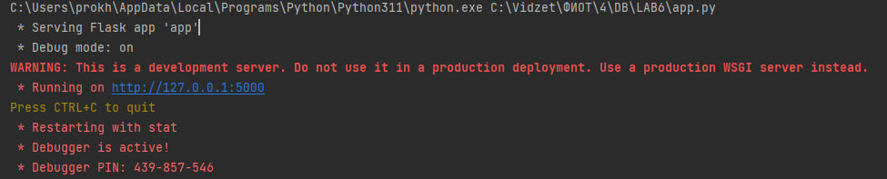
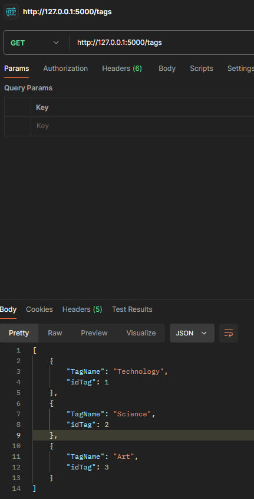
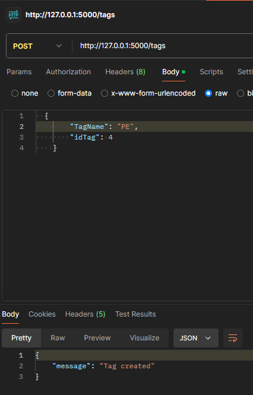
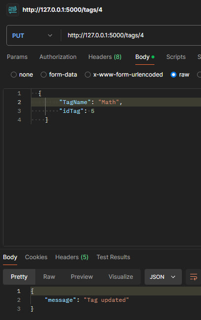
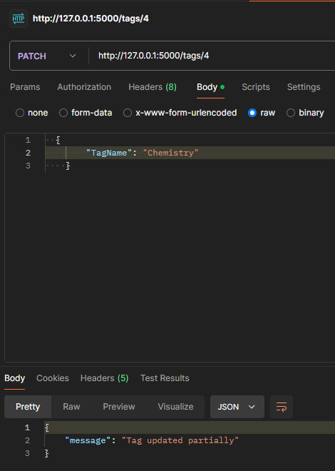
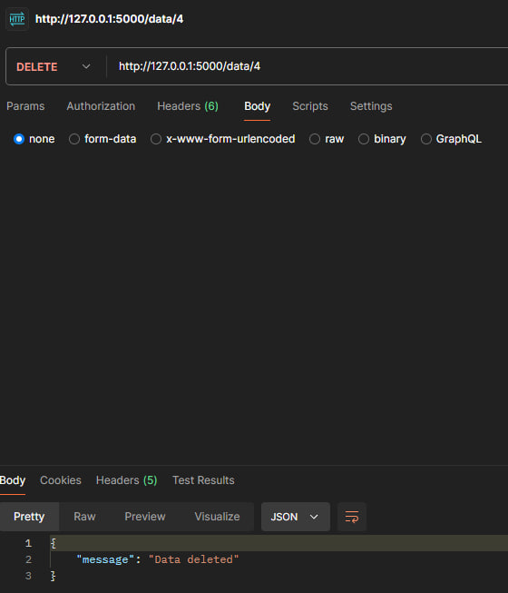

# Тестування працездатності системи
Для тестування системи використовувся додаток Postman
## Запуск сервера

 
## Метод GET

 
## Метод POST

## Метод PUT

 
 ## Метод PATCH

  ## Метод DELETE

